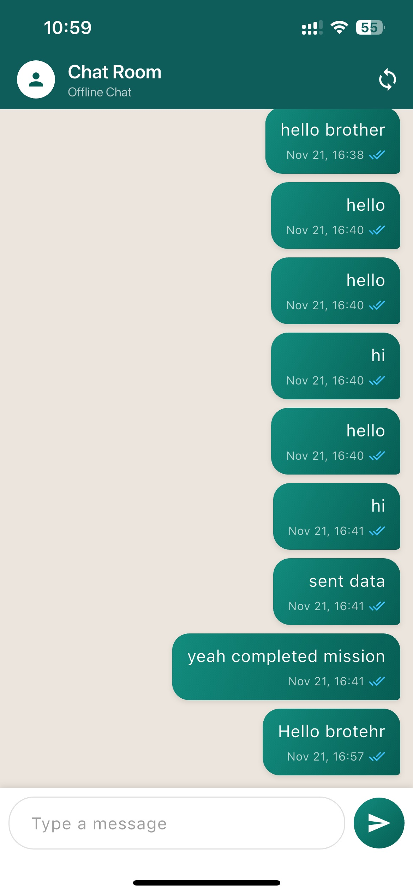
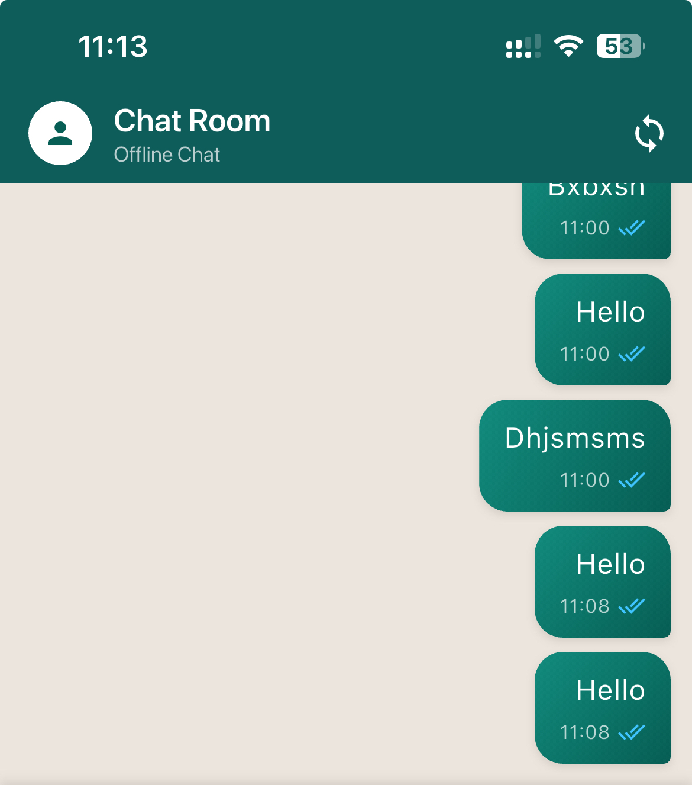
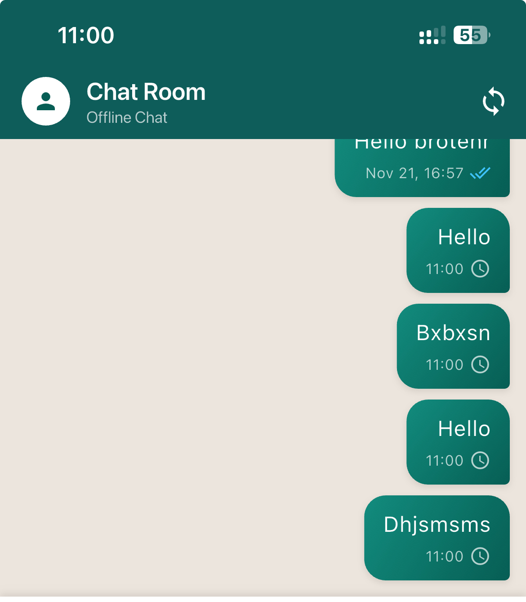

# 💬 Offline Chat with SQLite

Flutter chat app that works offline. Messages saved in SQLite, auto-sync when online.

## 📱 Screenshots

| Chat | Synced | Offline |
|------|--------|---------|
|  |  |  |

## ✨ Features

- 📴 Works without internet
- 💾 SQLite database (permanent storage)
- 🔄 Auto-sync when online
- ✓✓ Sync status indicators
- 🎨 WhatsApp-style UI

## 🔄 Hive → SQLite Migration

**Changed:**
- ❌ Hive (RAM-based) → ✅ SQLite (disk-based)
- ❌ Sync operations → ✅ Async operations
- ❌ Auto-refresh UI → ⚠️ Manual refresh

**Why SQLite?**
- Permanent disk storage
- Industry standard
- Better for larger datasets

## 🏗️ How It Works

```text
Send Message → Save to SQLite (offline)
              ↓ (when online)
            Sync to Server
              ↓
         Mark as Synced ✓✓
```

## 📦 Tech Stack

**Flutter:**
`sqflite` `path` `path_provider` `http` `connectivity_plus` `uuid` `intl`

**Backend:**
Node.js + Express + JSON storage

**Database:**
SQLite with 2 tables: `messages`, `settings`

## 📊 Database Schema

**messages**
```sql
id TEXT, text TEXT, sender TEXT, timestamp TEXT, isSynced INTEGER
```

**settings**
```sql
key TEXT, value TEXT
```

## 🚀 Quick Start

**1. Start Backend**

```bash
cd backend && npm install && node server.js
```

**2. Run App**

```bash
cd Chat_demo && flutter pub get && flutter run
```

**3. Set API URL** (in `lib/services/api_service.dart`)

- iOS Simulator: `http://localhost:3000`
- Android Emulator: `http://10.0.2.2:3000`
- Physical Device: `http://YOUR_IP:3000`

## 📡 API

```text
POST /sync
Request: { localMessages: [...], lastSyncTime: "ISO" }
Response: { success: true, serverMessages: [...] }
```

## 🧪 Test Offline

- **iOS:** Settings → Developer → Network → 100% Loss
- **Android:** Extended Controls → Settings → Cellular → None

---

Built with Flutter & SQLite
